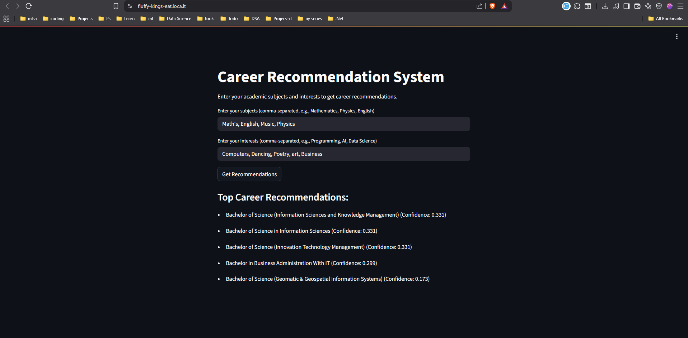

# Student Data Model

## Overview

This repository contains a student data model that includes unique entries for students, their subjects, and interests. The model aims to provide a structured approach to manage and analyze student information, making it useful for educational institutions, research, and data analysis purposes.

## Installations
pip install fastapi uvicorn scikit-learn
uvicorn model.fastAPI:app --reload

## Data Structure

The student data is organized in a CSV format with the following columns:

- **student_id**: A unique identifier for each student (e.g., S001, S002).
- **subjects**: A list of subjects the student is enrolled in, separated by commas (e.g., "Mathematics, Computer Science, Physics").
- **interests**: A list of interests related to the student's studies or hobbies, separated by commas (e.g., "Artificial Intelligence, Robotics").

### Example Data

Here’s an example of the data format:

```
student_id,subjects,interests
S001,"Mathematics, Computer Science, Physics","Artificial Intelligence, Robotics"
S002,"English, Literature, Creative Writing","Poetry, Storytelling"
```

## Usage

1. **Data Import**: The data can be imported into various data processing tools and environments (e.g., Python with pandas, R, Excel) for analysis and visualization.
   
2. **Data Analysis**: Use the data to analyze trends in subjects and interests among students, or to create visualizations that reflect student demographics.

3. **Model Integration**: This data model can be integrated into larger applications, such as student management systems or educational analytics platforms.

## Testing
https://fluffy-kings-eat.loca.lt/



## Contributing

Contributions are welcome! If you would like to contribute to this project, please follow these steps:

1. Fork the repository.
2. Create a new branch (e.g., `feature/your-feature`).
3. Make your changes and commit them.
4. Push to the branch.
5. Open a pull request with a description of your changes.

Start-up command:
gunicorn -w 4 -k uvicorn.workers.UvicornWorker --bind 0.0.0.0:8000 --timeout 500 --log-level debug model.model:app